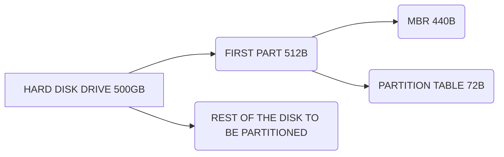
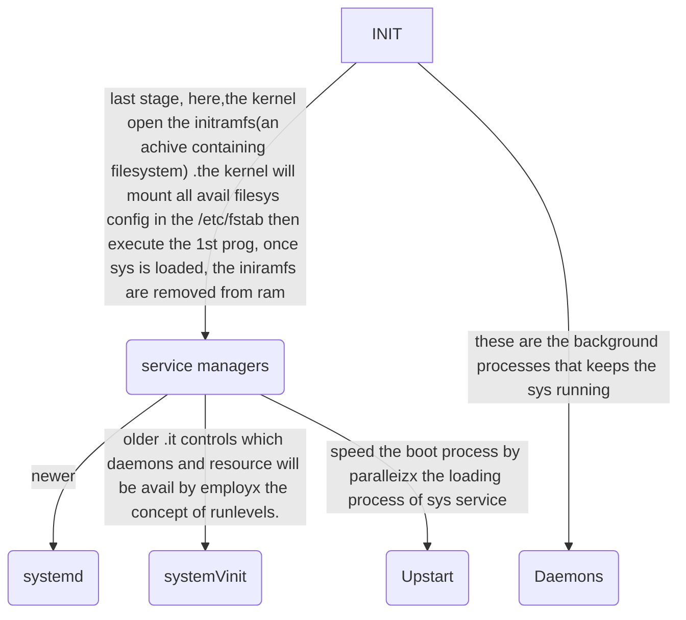

# SYSTEM ARCHITECTURE

This is a conceptual model that defines the structure,behaviour and more views of a system.
This presentation is subdivided into **3** topics
                      
## DETERMINING AND CONFIGURE HARDWARE SETTINGS

#### DEVICE ACTIVATION
These refers to the process of making hardware devices available for use by the O.S and user application.
            Once devices are correctly identified, it's up to the O.S to  associate the corresponding software components required by them.  
    ***BIOS SETTINGS*** which has purpose to identify,configures,test and connects computer hardware immediately after the computer is turned on. 
- To access the config setting (BIOS) press the key **F2** or **F12** when turning on your computer.
- Here,it's possible to enable and disable intergrated periperals and change hardware settings

#### DEVICE INSPECTION
 This is done by inspecting them using the following commands ;
- ``lspci``
Shows all devices currently connected to the PCI (Peripheral Component Interconnect) bus. 
- ``lsusb``
Lists USB (Universal Serial Bus) devices currently connected to the machine. 
The devices identified by the O.S will not be fully operational yet because every hardware part requires a software component to control devices.
This software component is known as **KERNEL MODULES**
                Commands directly related to hardware often require root privileges to execute or will only show
limited information when executed by a normal user, so it may be necessary to login as root or to
execute the command with ``sudo``.
- ``lsmod`` 
used to display all loaded modules 

- ``modprobe``
used to load and unload kernel modules
- ``/etc/modprobe.d/blacklist.conf``
To stop services from running.
The commands ``lspci``, ``lsusb`` and ``lsmod`` act as front-ends meaning the show the basic hardware component stored in an O.S in the ``/proc`` and ``/sys``
- ``/proc/cpuinfo``
display all information about the CPU.
- ``/sys``
stores device information and kernel related data to hardware .

#### Storage Devices
In Linux, storage devices are generically referred as block devices, because data is read to and
from these devices in blocks of buffered data with different sizes and positions.

## BOOT SYSTEM

**BIOS or UEFI**
BIOS is a program stored in a non-volatile memory chip attached to the motherboard , executed everytime the computer is powered on.
The pre-operating steps to boot a system equipped with BIOS are:
1. The POST (power-on self-test) process is executed to identify simple hardware failures as soon
as the machine is powered on.
2. The BIOS activates the basic components to load the system, like video output, keyboard and
storage media.
3. The BIOS loads the first stage of the bootloader from the MBR (the first 440 bytes of the first
device, as defined in the BIOS configuration utility).
4. The first stage of the bootloader calls the second stage of the bootloader, responsible for
presenting boot options and loading the kernel.
   **DIFFERENCES BETWEEN UEFI AND BIOS**
- **BIOS** uses MBR(master boot record) while **UEFI** uses GPT (GUI partition table)
- **UEFI** is extensible(designed to allow the addition of new capabilities and functionality.) while **BIOS** is not 
- **BIOS** has a max number of partition (**4**) while **UEFI** has (**128**)
These definitions indicate the location of the UEFI compatible programs, called EFI applications, that will be executed automatically or called from a boot menu. EFI applications can be bootloaders, operating system selectors, tools for system diagnostics and repair, etc. They must be in a conventional storage device partition and in a compatible filesystem. The standard compatible filesystems are ************FAT12**, **FAT16** and **FAT32** for block devices and ISO-9660 for optical media. the pre-operating system boot steps on a system with UEFI are:
1. The POST (power-on self-test) process is executed to identify simple hardware failures as the machine is powered on.
2. The UEFI activates the basic components to load the system, like video output, keyboard andstorage media.
3. UEFI’s firmware reads the definitions stored in NVRAM to execute the pre-defined EFI
application stored in the ESP partition’s filesystem. Usually, the pre-defined EFI application is a
bootloader.
4. If the pre-defined EFI application is a bootloader, it will load the kernel to start the operating
system.

**THE BOOTLOADER**
The most popular bootloader for Linux in the x86 architecture is GRUB (Grand Unified Bootloader).it display the list of O.S available to boot 
From the GRUB menu it is possible to choose which one of the installed kernels should be loaded
and to pass new parameters to it. 
The most useful kernel parameters are:
``acpi``
Enables/disables ACPI support. 
``init``
Sets an alternative system initiator. 
``systemd.unit``
Sets the systemd target to be activated. 
``mem``
set amount of available RAM for the system
``root``
set the root partition
 ***SYSTEM INITIALISATION***

**Initialization Inspection**
Errors may occur during the boot process, but they may not be so critical to completely halt the operating system.
The memory space where the kernel stores its messages, including the boot messages, is called the **kernel ring buffer**. The messages are kept in the kernel ring buffer even when they are not displayed during the initialization process.
- the kernel ring buffer loses all it messages when the system is turned off or using the command ``dmesg --clear`` without option
- ``dmesg``
display all current messages

## CHANGING RUNLEVELS/BOOT TARGETS AND SHUTDOWN OR REBOOT SYSTEM
### SysVinit

**SysVinit** is the traditional init system used in Unix and Linux 
Runlevels: SysVinit uses runlevels (0 to 6) to define different states of the system:
- Runlevel 0: Halt the system
- Runlevel 1: Single-user mode (for maintenance)
- Runlevel 2: Multi-user mode without networking
- Runlevel 3: Full multi-user mode (with networking)
- Runlevel 4: User-definable
- Runlevel 5: Multi-user mode with graphical interface (if available)
- Runlevel 6: Reboot the system
``/sbin/init``
responsible for managing runlevels and associated daemons.
``/etc/inittab``
it's where the init program identifies the requested runlevel
also defines the defalt runlevel
``telinit``
used to altenate between runlevels
``runlevel``
show the current runlevel of the system

### Systemd

**Systemd** is a modern init system that has become the default for many Linux distributions (like Ubuntu, CentOS, and Fedora). It provides more advanced features and improved service management compared to SysVinit.

### Key Features of Systemd:
- **Unit Files**: Systemd uses unit files to manage services. These files define how services are started, stopped, and configured, and are typically located in ``/etc/systemd/system/`` and ``/lib/systemd/system/``.
- **Targets**: Instead of runlevels, Systemd uses targets to define the state of the system (e.g., multi-user.target, graphical.target).
- **Parallel Service Startup**: Systemd can start services in parallel, which speeds up the boot process.
**Socket and Timer Activation**: Systemd can start services on-demand based on socket connections or timers, making it more efficient in resource management.
**Dependency Management**: Systemd manages service dependencies, ensuring that services are started in the correct order.
``systemctl``
used for controlling system units
Some ``systemctl`` action are;
``systemctl start unit.service``
Starts unit.
``systemctl stop unit.service``
Stops unit.
``systemctl restart unit.service``
Restarts unit.
``systemctl status unit.service``
Shows the state of unit, including if it is running or not.

**Upstart**
The initialization scripts used by Upstart are located in the directory`` /etc/init/``.

**SHUTDOWN AND RESTART**
``shutdown``
used to shutdown the system .
It automatically notifies all logged-in users with a warning message in their shell sessions and new
logins are prevented. Command shutdown acts as an intermediary to SysV or systemd procedures,
that is, it executes the requested action by calling the corresponding action in the services
manager adopted by the system.
After shutdown is executed, all processes receive the ``SIGTERM`` signal, followed by the ``SIGKILL``
signal, then the system shuts down or changes its runlevel. By default, when neither options -h or
-r are used, the system alternates to runlevel 1, that is, the single user mode. 
